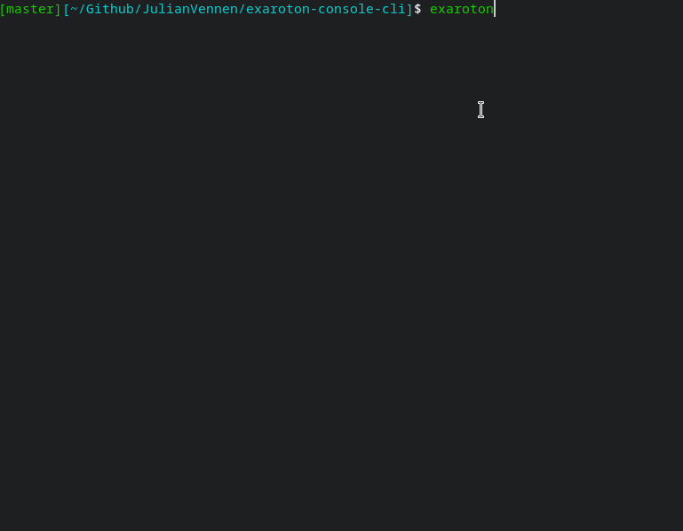

## exaroton-console-cli
A CLI application to subscribe to the console of your exaroton server. This allows you
to read and write to your console almost like the server is running on your local machine.

This project was mainly an excuse for me to use rust and might not be actively maintained.

### Planned Features
- only allow connections to servers that are online
- exit when the server shuts down
- select server using flag, use config as default
- add flag to show a select menu of all available servers
- add flag to stay open even if the server shuts down
- add flag to control how many messages are fetched
- add typing mode that adds `/say` to all inputs that don't start with `/`
- add other controls for your server
  - start/stop/restart
  - show server overview
  - set ram/motd
